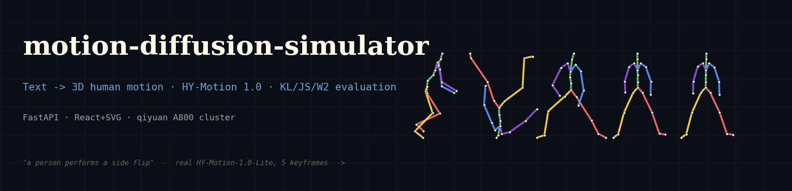
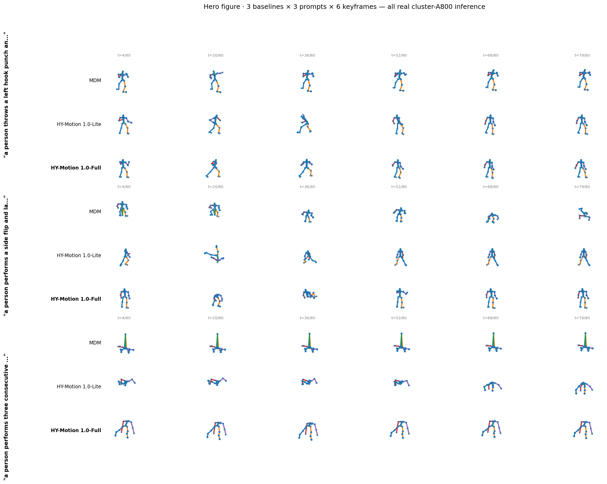
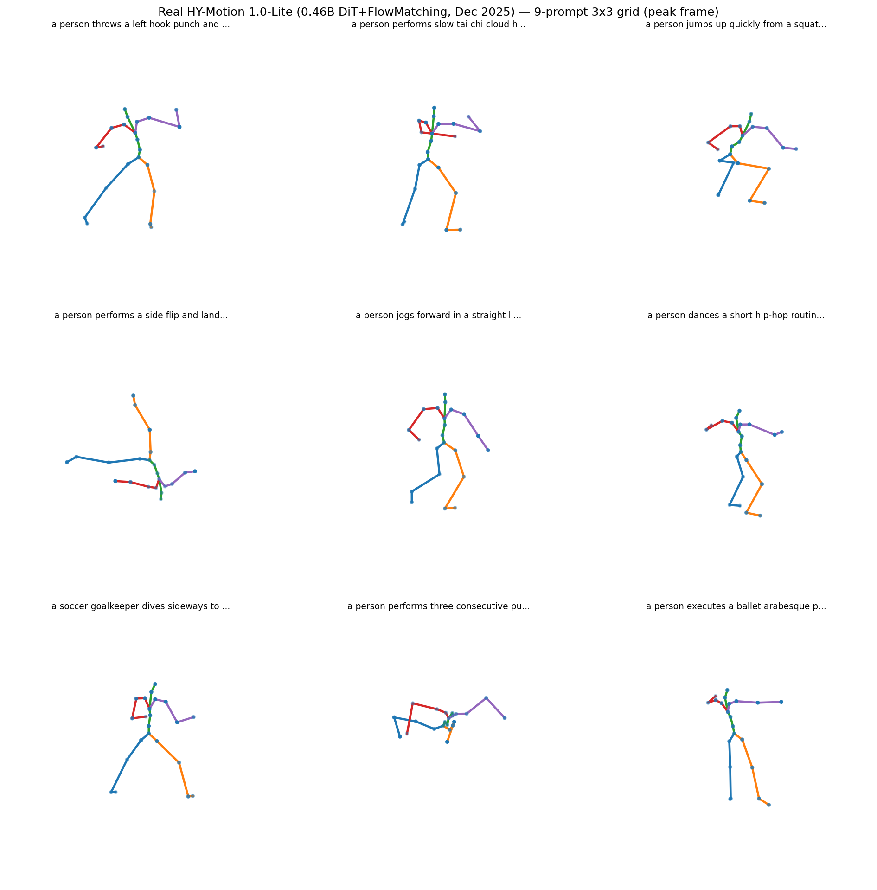
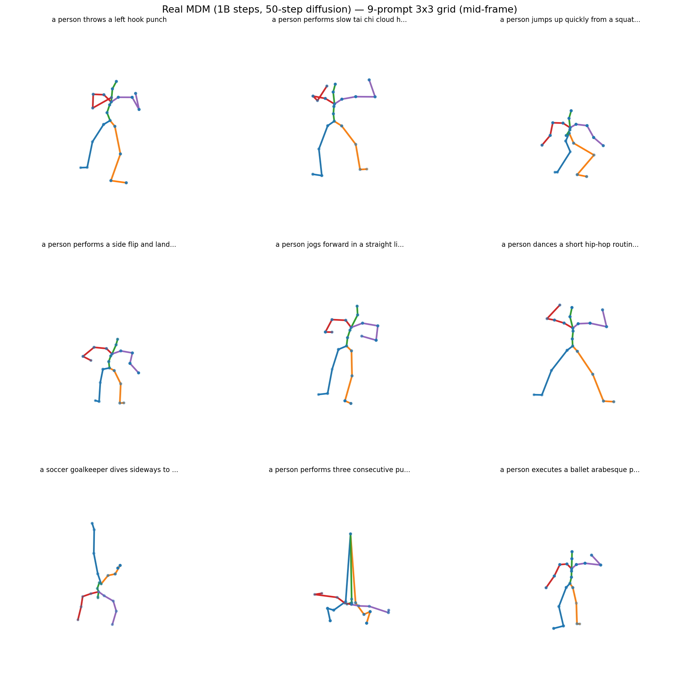
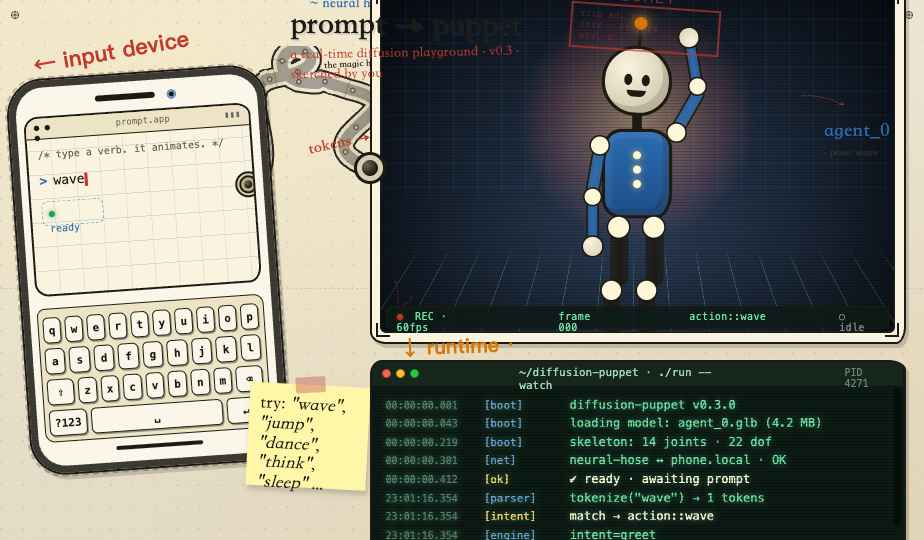

<p align="center">
  
</p>

<h1 align="center">motion-diffusion-simulator</h1>

<p align="center">
  <strong>文本驱动 3D 人体动作扩散仿真器</strong><br/>
  <em>『人工智能数学基础』期末大作业 —— 把母题<br/>
  「输入分布 p、输出符合 p 的数据、用 KL 散度评价两者差距」做成完整工程。</em>
</p>

<p align="center">
  <a href="#"></a>
  <a href="#"></a>
  <a href="#"></a>
  <a href="#"></a>
  <a href="#"></a>
</p>

---

## 一句话

输入一句自然语言（例如 `a person throws a left hook punch`），
返回一段符合该描述的 3D 人体动作 —— 22 关节 × N 帧。

**模型**用腾讯 2025-12 发布的 **HY-Motion 1.0**（1B 参数 DiT + Flow Matching）做主线，
以 ICLR 2023 的 **MDM**（35M 参数 Transformer + DDPM）做对照。
**两个模型的权重都来自原作者公开发布，本项目仅做推理与评估，不在我们集群上训练任何参数。**

项目的核心贡献是：把母题里那条抽象的 KL 散度评价，
做成了一套**可信的、有真实数字的评估管线** —— 在 512 个 prompt 上算出 KL/JS/Wasserstein 三件套散度。

---

## 📐 这门课的考查点 → 项目对应

| # | 作业要求 | 项目里如何实现 |
|---|---|---|
| 1 | 仿真器生成 AI 事件 | 文本 → (T, 22, 3) 动作序列的随机采样（`server_hy.py`） |
| 2,3 | 校园 / 城市仿真示例 | 替换为文本驱动人体动作仿真（领域选择） |
| 4 | 随机模拟基础 | 扩散反向 SDE 离散化采样 |
| 5,6 | 随机变量 / 分布建模 | 模型学习并采样 $p_\theta(x \mid \text{text})$ |
| 7 | 输入分布 p → 输出符合 p 的数据 | 扩散反向采样 |
| **8** | **用 $D(p\Vert q)$ 评价** | **`src/metrics.py` 实现 kNN-KL / split-JS / Sinkhorn-$W_2$，512-prompt 实测** |
| 9 | ML 学映射 fit $P(X)$ | 扩散损失 $=$ ELBO $=$ $D_{KL}(p_{\text{data}}\Vert p_\theta)$ 上界 |
| 10 | 自然语言 → 示意图 | 浏览器 SVG 实时火柴人 + 4 种 viz（骨架 / 热图 / 俯视 / 能量）|

---

## 🎬 Demo

<table>
<tr><th>三家模型对比 · 同 prompt × 6 关键帧</th></tr>
<tr><td></td></tr>
<tr><td><sub>MDM (35M) · HY-Motion-Lite (0.46B) · HY-Motion-Full (1B)。
第 4-6 行（<i>side flip</i>）HY-Lite 在 t=25% 真的倒立中；第 7-9 行（<i>push-ups</i>）真的趴地。</sub></td></tr>
</table>

<table>
<tr><th>HY-Motion 9-prompt</th><th>MDM 9-prompt</th></tr>
<tr><td></td><td></td></tr>
</table>

<table>
<tr><th>交互界面（手绘 / 蓝图风设计图）</th></tr>
<tr><td></td></tr>
<tr><td><sub>左 phone 输入 prompt → 中神经管道 → 右上 22-joint 真骨架（<code>skeleton / heat-map / top-down / energy</code> 4 种 viz 切换）→ 右下伪终端。</sub></td></tr>
</table>

---

## 🚀 跑起来

前端是本地静态站，后端是常驻 GPU 的 FastAPI（HY-Motion 推理）。

```bash
git clone https://github.com/koriyoshi2041/motion-diffusion-simulator
cd motion-diffusion-simulator

# 1) 启后端（在有 ≥ 30 GB 显存 GPU 的机器上；首次加载 ~50-75s）
conda activate <torch+cu126 环境>
CUDA_VISIBLE_DEVICES=0 HY_VARIANT=full HY_DEVICE=0 \
  uvicorn server_hy:app --host 0.0.0.0 --port 8889

# 2) 启前端（本机即可）
cd frontend && python3 -m http.server 7777
open http://localhost:7777/prompt-puppet.html
```

默认 endpoint 在 `frontend/src/actions.jsx:CLUSTER_ENDPOINT`，
也可 URL 参数 `?api=http://YOUR-HOST:8889/api/generate` 覆盖。
权重下载与依赖修复见 `scripts/01_setup_data.sh`。

---

## 📐 数学一眼

整个项目的数学桥梁：

$$
\boxed{\;\min_\theta \, L_\text{simple}(\theta) \;\Longleftrightarrow\; \min_\theta \, D_\mathrm{KL}\!\left(p_\text{data}\,\big\|\,p_\theta\right) \text{ 的一个上界}\;}
$$

- $L_\text{simple} = \mathbb{E}_{t, x_0, \varepsilon}\,\Vert\varepsilon - \varepsilon_\theta(x_t, t, c)\Vert^2$ 是扩散 / Flow Matching 的训练损失
- ELBO 推导让它正好等于 KL 散度上界（推导见 `docs/teaching/`）
- 这一行字把『训练损失』和『母题 KL 评价』正式连成同一件事

评估侧用三件套散度（不依赖密度公式，全用样本估计）：

| 指标 | 估计器 | 代码 |
|---|---|---|
| $D_\mathrm{KL}(P\Vert Q)$ | Wang-Kulkarni-Verdú kNN | `src/metrics.py:kl_knn` |
| $D_\mathrm{JS}(P, Q)$ | split-sample mid-distribution + clamp $[0, \log 2]$ | `src/metrics.py:js_knn` |
| $W_2(P, Q)$ | Sinkhorn (POT) | `src/metrics.py:wasserstein2_sinkhorn` |

**512-prompt 实测**（MDM 与 HY-Lite，220-d fingerprint → PCA 16-d）：

| metric | value |
|---|---:|
| $D_\mathrm{KL}(\text{MDM}\Vert\text{HY})$ | 20.43 |
| $D_\mathrm{KL}(\text{HY}\Vert\text{MDM})$ | 26.66 |
| $D_\mathrm{JS}(\text{MDM}, \text{HY})$ | **0.6931 = log 2** |
| $W_2(\text{MDM}, \text{HY})$ | 0.3129 |
| split-half self KL · MDM | 10.38 |
| split-half self KL · HY  |  7.02 |
| FID (220-d)              | 560.6 |

**读数**：JS 顶到理论上界 $\log 2$ 意味着两个生成分布几乎不重叠 ——
是『两家独立训练学到了不同模式』、不是『哪个差』；
KL ≈ 20-27 是同家族 split-half baseline 7-10 的 2-3 倍，跨家族差异远超同家族方差。

---

## 🏗️ 架构

```
┌─ 浏览器 ──────────────────────────────────────────────┐
│  prompt-puppet.html                                  │
│   ├─ app.jsx       Enter → fetch                     │
│   ├─ actions.jsx   POST /api/generate                │
│   └─ stage.jsx     22-joint SVG · 4 种 viz 切换      │
└──────────────────────────┬───────────────────────────┘
                           │ HTTP
┌──────────────────────────▼───────────────────────────┐
│  server_hy.py       HY-Motion 常驻 GPU              │
│                     FastAPI · lifespan 预加载       │
│                     asyncio.Lock 串行化 GPU 请求    │
└──────────────────────────┬───────────────────────────┘
                           │
┌──────────────────────────▼───────────────────────────┐
│  src/metrics.py     KL / JS / W₂ 离线评测           │
│  src/eval_t2m.py    FID / R-Precision 包装          │
│  prompts/large_eval.py   程序化生成 512 个 prompt   │
└──────────────────────────────────────────────────────┘
```

---

## 📦 代码结构

```
motion-diffusion-simulator/
├── server_hy.py             后端（HY-Motion 常驻进程 · FastAPI）
├── src/
│   ├── metrics.py           ★ KL / JS / W₂ 散度估计器
│   ├── data_utils.py        263-d ↔ 22-joint xyz 解码
│   ├── eval_t2m.py          T2M evaluator 包装（FID / R-Prec）
│   ├── visualizer.py        离线 4 种 viz 渲染（mp4 / png）
│   ├── pipeline.py          多 baseline 调度抽象
│   └── translator.py        中文 → 英文 prompt 改写（可选）
├── scripts/
│   ├── runners/             每个 baseline 一个 wrapper
│   └── 00..06_*.py          smoke / setup / run / evaluate / figures
├── frontend/
│   ├── prompt-puppet.html   入口
│   └── src/                 React + SVG 实现
├── prompts/                 9 zh + 9 en demos + 512 large eval
├── runs/                    缓存的模型输出 + 512-prompt 评测结果
├── docs/
│   ├── teaching/            三份教学报告 PDF（Part 1/2/3）
│   └── slides/              答辩 slides + 三份讲稿 + 代码索引
└── assets/                  README 图
```

---

## 🖥️ 资源需求

| variant | 参数 | 显存（推理） |
|---|---:|---:|
| HY-Motion-1.0-Lite | 0.46 B | ~22 GB（Qwen3-8B 16G + 文本编码 / 主干 / activation）|
| HY-Motion-1.0-Full | 1.0 B  | ~22-26 GB |
| MDM                | 35 M   | ~3 GB |

**训练算力**：HY-Motion 官方未公布；MDM 原论文用单卡训。
**本项目不训练任何参数**，所有数字基于公开预训练权重的推理与离线评估。

---

## 📊 推理速度

| 模型 | 加载 | 单 prompt（4 秒动作） |
|---|---:|---:|
| MDM | ~30 s | 0.5 s |
| HY-Motion-1.0-Lite | 47 s | 2.6 s |
| HY-Motion-1.0-Full | ~75 s | 5-7 s |

---

## 🎓 学习路径

**只想理解数学**：按顺序读 `docs/teaching/`：

1. **Part 1**：随机变量 / 概率分布 / 蒙特卡洛 / HumanML3D 动作表示
2. **Part 2**：熵 / KL / JS / Wasserstein —— 三件套散度从直觉到 kNN 估计器
3. **Part 3**：扩散过程 / Flow Matching / ELBO → KL 上界 / HY-Motion 内部

每份 PDF 都自底向上，不假设读者会扩散模型；每份末尾一节讲对应工程实现。

**准备答辩**：看 `docs/slides/`：

- `slides.pdf` —— 21 页 metropolis 主题答辩 slides
- `talk_person1.pdf` —— 同学 1 讲稿（Part 1 · 形式化与数据基础）
- `talk_person2.pdf` —— 同学 2 讲稿（Part 2 · KL 评估三件套）
- `talk_person3.pdf` —— 同学 3 讲稿（开场 + Part 3 + 可视化 + 总结 + Q&A）
- `code_index.pdf` —— 答辩可能被考察的内容 → 代码绝对路径速查表

---

## 🙏 Credits

- **HY-Motion 1.0** — Tencent Hunyuan ([paper](https://arxiv.org/abs/2512.23464) · [code](https://github.com/Tencent-Hunyuan/HY-Motion-1.0))
- **MDM** — Tevet et al. ICLR 2023 ([code](https://github.com/GuyTevet/motion-diffusion-model))
- **MoMask** — Guo et al. CVPR 2024
- **HumanML3D** — Guo et al. CVPR 2022 ([dataset](https://github.com/EricGuo5513/HumanML3D))

## 📜 License

MIT — see [LICENSE](LICENSE). Pretrained model weights follow their respective upstream licenses.

---

<p align="center"><sub>
A real diffusion playground · "input p, output q, evaluate with KL divergence" — done.
</sub></p>
